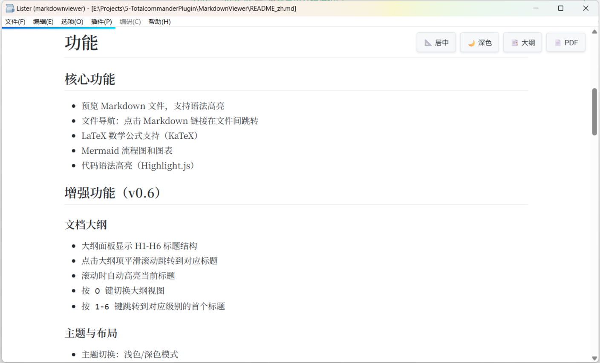

[中文](./README_zh.md)

# MarkdownViewer

MarkdownViewer is a Total Commander plugin, using preview markdown file which suffixed with md markdown and mk.

# Features

- Support for previewing Markdown files
- Support for file navigation/jumping
- Support for LaTeX and Mermaid flowcharts

# About Installation 

This plugin is based on the .NET platform, so the corresponding interface needs to be installed. The installation file is [TcPluginSetup.msi](./Doc/TcPluginSetup.msi) — simply double-click to run it.

Then, double-click to open `MarkdownViewer.zip` in Total Commander and follow the prompts to install the plugin.

The latest version uses WebView2. If you are using an older operating system, you will need to install the WebView2 runtime.

# About Usage

Currently, the preview window cannot be closed using the ESC key. Please click the close button on the preview window to close it.

# Version

## v0.1

- support preview markdown file

## v0.2

- fixed: cannot close window with Esc [\#4](https://github.com/wangzhfeng/MarkdownViewer/issues/4)
- using Nuget to manage dependency

Thanks to [thorn0](https://github.com/thorn0) for your commit.

## v0.3

- feature: support print, can print to pdf through local printer
- fixed: cannot preview local image
- fixed: cannot select and copy [\#7](https://github.com/wangzhfeng/MarkdownViewer/issues/7)
- fixed: dependented dll not package in output zip

## v0.4

- Fixed Issue #15: Image preview issue with Chinese file paths
- Fixed Issue #6 & #13: Total Commander losing focus issue

Regarding the fixed Esc key closing window issue in v0.2, it was found that the function frequently malfunctions. Several other solutions have been attempted, but the issue has not been resolved yet.

## v0.5

- Issue #11: Added support for file jumping/navigation
- Upgraded Mermaid and KaTeX libraries
- Switched rendering engine to WebView2 to improve compatibility
- Fixed: Issue where the ESC key failed to close the window

## v0.6 (In Development)

- Feature: Added outline view panel showing document structure (H1-H6 headings)
- Feature: Click outline items to jump to headings with smooth scroll
- Feature: Press `O` key to toggle outline view
- Feature: Press `1-6` keys to jump to first heading of corresponding level
- Feature: Auto-highlight current heading while scrolling
- Feature: Added theme switching (light/dark mode)
- Feature: Press `T` key to toggle theme
- Feature: Theme preference saved to localStorage
- Feature: Added layout modes (centered narrow / full-width)
- Feature: Press `M` key to toggle layout
- Feature: Layout preference saved to localStorage
- Feature: Added Vim-style keyboard navigation
- Feature: `j/k` - scroll line by line
- Feature: `d/u` - scroll half page down/up
- Feature: `f/b` - scroll full page down/up
- Feature: `gg` - scroll to top
- Feature: `G` - scroll to bottom
- Feature: `h/l` - scroll left/right
- Feature: Click images to view in full screen
- Feature: Press `ESC` or click to close image viewer
- Feature: Image alt text shown as caption
- Feature: Reading progress bar at top of page
- Feature: Real-time scroll progress indication
- Feature: Gradient blue progress bar style
- Technical: Added `KeyboardCallback` class for keyboard event handling
- Technical: Enhanced CSS with outline panel, tree structure, and toggle button styles
- Technical: Added CSS variables for dark theme support
- Technical: Added layout CSS classes for responsive width control
- Technical: Enhanced keyboard handler for Vim-style navigation
