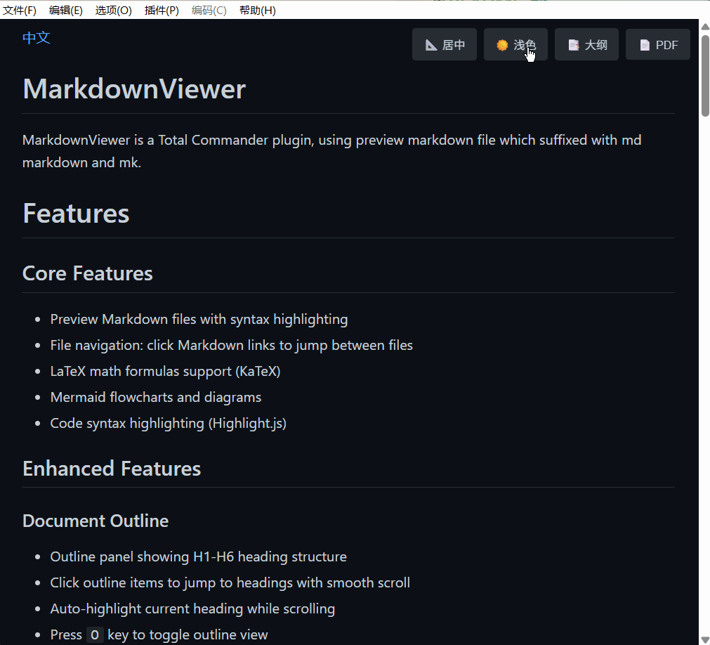
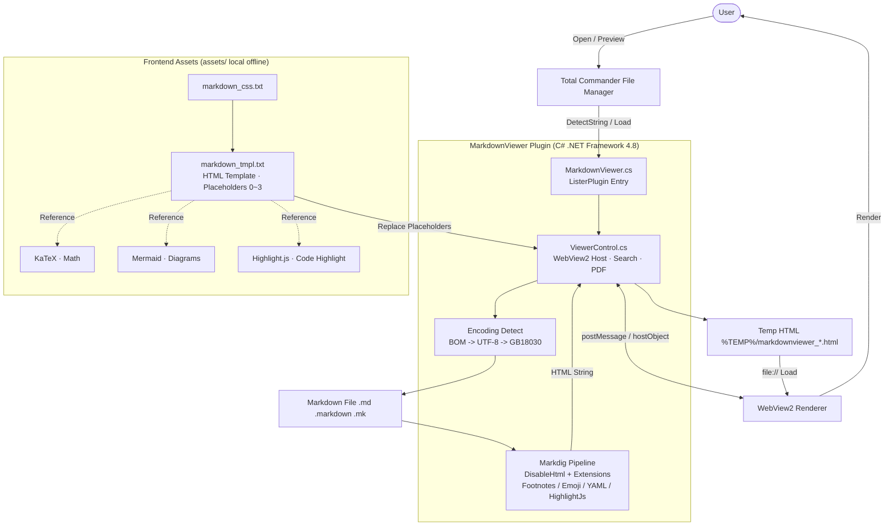

[中文](./README_zh.md)

# MarkdownViewer

MarkdownViewer is a Total Commander plugin, using preview markdown file which suffixed with md markdown and mk.



# Features

## Core Features

- Preview Markdown files with syntax highlighting
- File navigation: click Markdown links to jump between files
- LaTeX math formulas support (KaTeX)
- Mermaid flowcharts and diagrams
- Code syntax highlighting (Highlight.js)

## Enhanced Features

### Document Outline

- Outline panel showing H1-H6 heading structure
- Click outline items to jump to headings with smooth scroll
- Auto-highlight current heading while scrolling
- Press `O` key to toggle outline view
- Press `1-6` keys to jump to first heading of corresponding level

### Themes & Layout

- Theme switching: light / dark mode
- Press `T` key to toggle theme
- Layout modes: centered narrow / full-width
- Press `M` key to toggle layout

### Keyboard Navigation

- Vim-style navigation: `j/k` (line), `d/u` (half page), `f/b` (full page)
- Quick jump: `gg` (top), `G` (bottom), `h/l` (horizontal scroll)
- Press `?` to show shortcut help panel

### Image & Media

- Click images to view in full screen
- Press `ESC` or click to close image viewer
- Image alt text shown as caption

### Reading Experience

- Reading progress bar at top of page
- Real-time scroll progress indication
- Gradient blue progress bar style

### Export & External Links

- Export to PDF: press `P` key or click PDF button
- External links open in default browser

## Architecture


```mermaid
flowchart TB
    User([User])
    TC[Total Commander File Manager]
    MD[Markdown File .md .markdown .mk]
    Temp[Temp HTML %TEMP%/markdownviewer_*.html]
    WV[WebView2 Renderer]

    subgraph Plugin["MarkdownViewer Plugin (C# .NET Framework 4.8)"]
        direction TB
        Entry["MarkdownViewer.cs<br/>ListerPlugin Entry"]
        Ctrl["ViewerControl.cs<br/>WebView2 Host · Search · PDF"]
        Pipeline["Markdig Pipeline<br/>DisableHtml + Extensions<br/>Footnotes / Emoji / YAML / HighlightJs"]
        Encode["Encoding Detect<br/>BOM -> UTF-8 -> GB18030"]
    end

    subgraph Assets["Frontend Assets (assets/ local offline)"]
        direction TB
        Tmpl["markdown_tmpl.txt<br/>HTML Template · Placeholders 0~3"]
        CSS[markdown_css.txt]
        KaTeX[KaTeX · Math]
        Mermaid[Mermaid · Diagrams]
        HL[Highlight.js · Code Highlight]
    end

    User -->|Open / Preview| TC
    TC -->|DetectString / Load| Entry
    Entry --> Ctrl
    Ctrl --> Encode
    Encode --> MD
    MD --> Pipeline
    Pipeline -->|HTML String| Ctrl
    CSS --> Tmpl
    Tmpl -->|Replace Placeholders| Ctrl
    Ctrl --> Temp
    Temp -->|file:// Load| WV
    Tmpl -.Reference.-> KaTeX
    Tmpl -.Reference.-> Mermaid
    Tmpl -.Reference.-> HL
    WV -->|Render| User
    WV <-->|postMessage / hostObject| Ctrl
```

# About Installation 

This plugin is based on the .NET platform, so the corresponding interface needs to be installed. The installation file is [TcPluginSetup.msi](./Doc/TcPluginSetup.msi) — simply double-click to run it.

Then, double-click to open `MarkdownViewer.zip` in Total Commander and follow the prompts to install the plugin.

The latest version uses WebView2. If you are using an older operating system, you will need to install the WebView2 runtime.

# Building from Source

## Prerequisites

- Windows with Visual Studio 2017 or later (including the .NET Framework 4.8 development tools)
- Git Bash (bundled with GNU Make)

## Build

A `Makefile` is provided at the repository root. Run in Git Bash:

```bash
make debug      # build the Debug version
make release    # build the Release version
make all        # build Debug + Release
make restore    # restore NuGet packages only
make clean      # clean build artifacts
```

The output ZIP (`MarkdownViewer.zip`) is generated at:

- Debug: `MarkdownViewer/bin/Debug/`
- Release: `MarkdownViewer/bin/Release/`

MSBuild and NuGet are auto-detected, and can be overridden via environment variables:

```bash
MSBUILD=/path/to/MSBuild.exe NUGET=/path/to/nuget.exe make release
```

You can also build directly with MSBuild:

```bash
nuget restore MarkdownViewer.sln
msbuild MarkdownViewer.sln -p:Configuration=Release -p:Platform="Any CPU"
```


# Version

## v1.0.0 (2026-09-08)

### Security

- Disable inline HTML in Markdig to block script injection from untrusted Markdown files

### Improvements

- Auto-detect file encoding (UTF-8 / GBK) to fix garbled Chinese text
- Bundle front-end libraries (KaTeX / Mermaid / Highlight.js) locally for offline use

### Build

- Add `Makefile` to build Debug / Release versions locally

## v0.6 (2026-03-17)

### Document Outline

- Outline panel showing H1-H6 heading structure
- Click outline items to jump to headings with smooth scroll
- Auto-highlight current heading while scrolling
- Press `O` key to toggle outline view
- Press `1-6` keys to jump to first heading of corresponding level

### Themes & Layout

- Theme switching: light / dark mode
- Press `T` key to toggle theme
- Layout modes: centered narrow / full-width
- Press `M` key to toggle layout

### Keyboard Navigation

- Vim-style navigation: `j/k/d/u/f/b/g/G/h/l`
- Press `?` to show shortcut help panel

### Export & External Links

- Export to PDF: press `P` key or click PDF button
- External links open in default browser

### Bug Fixes

- Fixed: ESC key not working reliably to close preview

## v0.5

- Issue #11: Added support for file jumping/navigation
- Upgraded Mermaid and KaTeX libraries
- Switched rendering engine to WebView2 to improve compatibility
- Fixed: Issue where the ESC key failed to close the window

## v0.4

- Fixed Issue #15: Image preview issue with Chinese file paths
- Fixed Issue #6 & #13: Total Commander losing focus issue

## v0.3

- Feature: Support print, can print to PDF through local printer
- Fixed: Cannot preview local images
- Fixed: Cannot select and copy content [\#7](https://github.com/wangzhfeng/MarkdownViewer/issues/7)
- Fixed: Dependent DLLs not packaged in output zip

## v0.2

- Fixed: Cannot close window with Esc [\#4](https://github.com/wangzhfeng/MarkdownViewer/issues/4)
- Using NuGet to manage dependencies

Thanks to [thorn0](https://github.com/thorn0) for your commit.

## v0.1

- Support previewing Markdown files
