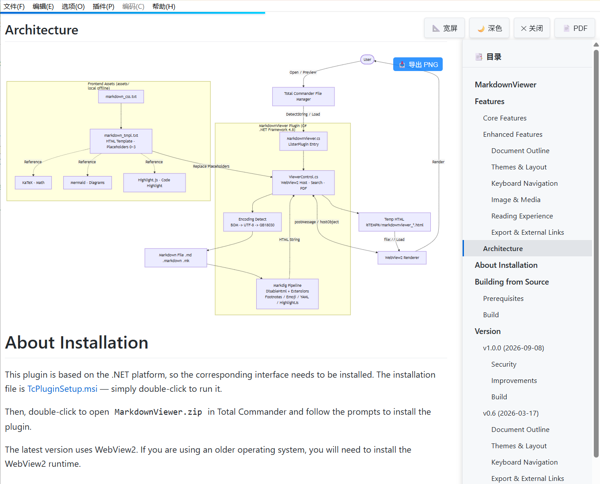

# MarkdownViewer

MarkdownViewer 是一款 Total Commander 的插件，用于浏览 markdown 文件，支持后缀为 md 和 markdown 的文件。



# 功能

## 核心功能

- 预览 Markdown 文件，支持语法高亮
- 文件导航：点击 Markdown 链接在文件间跳转
- LaTeX 数学公式支持（KaTeX）
- Mermaid 流程图和图表
- 代码语法高亮（Highlight.js）

## 增强功能

### 文档大纲

- 大纲面板显示 H1-H6 标题结构
- 点击大纲项平滑滚动跳转到对应标题
- 滚动时自动高亮当前标题
- 按 `O` 键切换大纲视图
- 按 `1-6` 键跳转到对应级别的首个标题

### 主题与布局

- 主题切换：浅色/深色模式
- 按 `T` 键切换主题
- 布局模式：居中窄栏/全文宽屏
- 按 `M` 键切换布局

### 键盘导航

- Vim 风格导航：`j/k/d/u/f/b/g/G/h/l`
- 按 `?` 显示快捷键帮助面板

### 图片与媒体

- 点击图片全屏查看
- 按 `ESC` 或点击关闭图片查看器
- 显示图片 alt 文本作为标题

### 阅读体验

- 页面顶部阅读进度条
- 实时滚动进度指示
- 渐变蓝色进度条样式

### 导出与外部链接

- 导出 PDF：按 `P` 键或点击 PDF 按钮
- 外部链接使用默认浏览器打开

# 安装说明

本插件基于.net 平台，所以需要安装对应接口，安装文件为 [TcPluginSetup.msi](./Doc/TcPluginSetup.msi)，直接双击运行即可。

然后在 TotalCommander 中双击打开 `MarkdownViewer.zip`，按照提示安装插件。

最新版本使用了 WebView2，如果是老版本的操作系统，需要安装 WebView2 的运行时。

# 从源码构建

## 环境要求

- Windows，安装 Visual Studio 2017 或更高版本（含 .NET Framework 4.8 开发工具）
- Git Bash（自带 GNU Make）

## 构建步骤

项目根目录提供了 `Makefile`，在 Git Bash 中执行：

```bash
make debug      # 构建 Debug 版本
make release    # 构建 Release 版本
make all        # 依次构建 Debug + Release
make restore    # 仅还原 NuGet 包
make clean      # 清理构建产物
```

构建产物为 `MarkdownViewer.zip`，位于：

- Debug：`MarkdownViewer/bin/Debug/`
- Release：`MarkdownViewer/bin/Release/`

MSBuild 与 NuGet 会自动探测，也可通过环境变量指定：

```bash
MSBUILD=/path/to/MSBuild.exe NUGET=/path/to/nuget.exe make release
```

也可直接使用 MSBuild：

```bash
nuget restore MarkdownViewer.sln
msbuild MarkdownViewer.sln -p:Configuration=Release -p:Platform="Any CPU"
```

# 版本历史

## v1.0.0 (2026-09-08)

### 安全

- Markdig 禁用内嵌 HTML，阻止不可信 Markdown 文件的脚本注入

### 改进

- 自动探测文件编码（UTF-8 / GBK），修复中文乱码
- 前端库（KaTeX / Mermaid / Highlight.js）本地化打包，支持离线使用

### 构建

- 新增 `Makefile`，支持本地构建 Debug / Release 版本

## v0.6 (2026-03-17)

### 文档大纲

- 大纲面板显示 H1-H6 标题结构
- 点击大纲项平滑滚动跳转到对应标题
- 滚动时自动高亮当前标题
- 按 `O` 键切换大纲视图
- 按 `1-6` 键跳转到对应级别的首个标题

### 主题与布局

- 主题切换：浅色/深色模式
- 按 `T` 键切换主题
- 布局模式：居中窄栏/全文宽屏
- 按 `M` 键切换布局

### 键盘导航

- Vim 风格导航：`j/k/d/u/f/b/g/G/h/l`
- 按 `?` 显示快捷键帮助面板

### 导出与外部链接

- 导出 PDF：按 `P` 键或点击 PDF 按钮
- 外部链接使用默认浏览器打开

### Bug 修复

- 修复：ESC 键无法可靠关闭预览窗口的问题

## v0.5

- Issue #11: 支持文件跳转
- 升级 Mermaid 和 KaTeX 库
- 将渲染引擎修改为 WebView2，提升兼容性
- 修复：ESC 无法关闭问题

## v0.4

### 修复问题

- 修复 Issue #15: 中文路径图片预览问题
- 修复 Issue #6 & #13: Total Commander 失焦问题

### 其他

针对 v0.2 中修复的 Esc 关闭窗口问题，发现经常性功能失灵，尝试了几种其他方案，暂时还没修复。

更新了配置文件中的相关工具地址。

## v0.3

### 新功能

- 支持打印文件，可使用本地打印机将预览结果打印为 PDF

### 修复问题

- 无法预览本地图片
- 无法选中并复制内容 [\#7](https://github.com/wangzhfeng/MarkdownViewer/issues/7)
- 无法将依赖 dll 文件打包到最终结果包

## v0.2

- 修复：不支持 Esc 键关闭窗口的问题 [\#4](https://github.com/wangzhfeng/MarkdownViewer/issues/4)
- 使用 NuGet 安装 markdig 库，方便本地开发

以上，多谢 [thorn0](https://github.com/thorn0) 提供的 Commit。

## v0.1

- 支持查看 markdown
